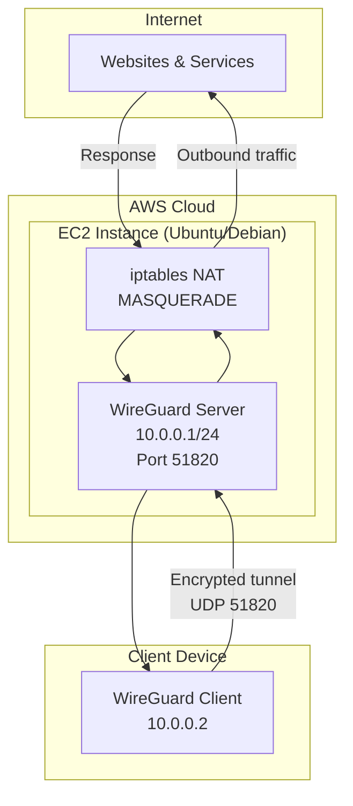
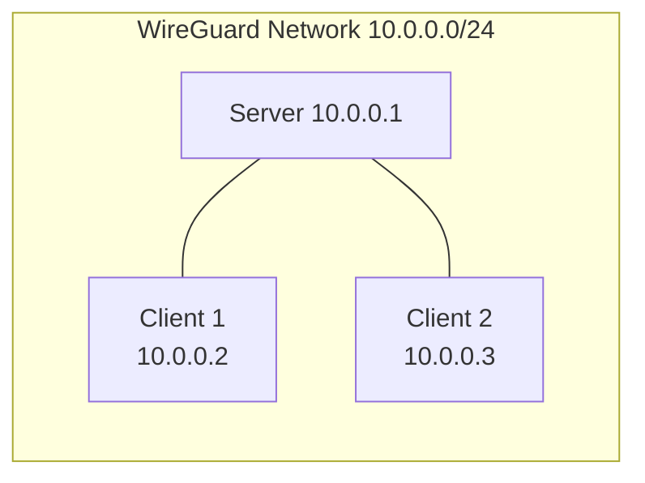

# AWS WireGuard VPN

A step-by-step guide to deploy a **WireGuard VPN server** on AWS EC2. Securely tunnel your internet traffic through an Ubuntu/Debian cloud instance for privacy, bypassing geo-restrictions, or accessing private networks remotely.


---

## Features

- **Modern VPN** — WireGuard is fast, lightweight, and uses state-of-the-art cryptography
- **AWS-hosted** — Run your own VPN on EC2 with full control over the server
- **Simple setup** — Clear instructions for server and client configuration
- **NAT traversal** — Client traffic is masqueraded through the server for internet access
- **Multi-client** — Support multiple peers with unique IPs (10.0.0.2, 10.0.0.3, …)

---

## Architecture



### Data Flow

1. **Client** → Encrypts traffic and sends it to the **WireGuard server** (UDP 51820)
2. **Server** → Decrypts, applies NAT (MASQUERADE), and forwards to the **internet**
3. **Internet** → Response returns to the server, which encrypts and sends back to the **client**

---

## Prerequisites

- **AWS account** with an EC2 instance (Ubuntu 20.04+ or Debian 11+)
- **Security group**: Allow inbound UDP on port **51820**
- **SSH access** to the EC2 instance

---

## Quick Start

### 1. Launch EC2 & Open Port

1. Launch an Ubuntu/Debian EC2 instance (t2.micro or larger)
2. In the **Security Group**, add an inbound rule:
   - **Type**: Custom UDP
   - **Port**: 51820
   - **Source**: `0.0.0.0/0` (or restrict to your IP for extra security)

### 2. Server Setup

SSH into your instance and follow the steps below.

---

## Server Setup (Ubuntu/Debian)

### Step 1: Install WireGuard

```bash
sudo apt update
sudo apt install wireguard -y
```

### Step 2: Generate Server Keys

```bash
wg genkey | tee server_private.key | wg pubkey > server_public.key
```

Verify keys were created:

```bash
cat server_private.key
cat server_public.key
```

### Step 3: Create WireGuard Config

```bash
sudo nano /etc/wireguard/wg0.conf
```

Add the following (replace `[SERVER_PRIVATE_KEY]` with the output of `cat server_private.key`):

```ini
[Interface]
Address = 10.0.0.1/24
ListenPort = 51820
PrivateKey = [SERVER_PRIVATE_KEY]

# NAT/masquerade for routing client traffic to the internet
# Replace "ens5" with your default network interface (check: ip route list default)
PostUp = iptables -t nat -A POSTROUTING -o ens5 -j MASQUERADE
PreDown = iptables -t nat -D POSTROUTING -o ens5 -j MASQUERADE
```

> **Tip:** Find your default interface with `ip route list default` (common names: `ens5`, `eth0`, `ens3`)

### Step 4: Enable IP Forwarding

```bash
sudo nano /etc/sysctl.conf
```

Add or uncomment:

```
net.ipv4.ip_forward=1
```

Apply changes:

```bash
sudo sysctl -p
```

### Step 5: Start the VPN

```bash
sudo wg-quick up wg0
```

### Step 6: Add a Client (Peer)

Edit the config:

```bash
sudo nano /etc/wireguard/wg0.conf
```

Add a `[Peer]` block for each client (use the client's public key):

```ini
[Peer]
PublicKey = [CLIENT_PUBLIC_KEY]
AllowedIPs = 10.0.0.2/32
```

Reload the config:

```bash
sudo wg-quick down wg0
sudo wg-quick up wg0
```

For additional clients, use `10.0.0.3/32`, `10.0.0.4/32`, etc.

---

## Client Setup

### Step 1: Generate Client Keys

On your **local machine** (macOS, Windows, Linux, iOS, Android):

```bash
wg genkey | tee client_private.key | wg pubkey > client_public.key
```

Share `client_public.key` with the server admin. Get the server's public key from them.

### Step 2: Create Client Config

Create a config file and replace the placeholders:

```ini
[Interface]
PrivateKey = [CLIENT_PRIVATE_KEY]
Address = 10.0.0.2/32
DNS = 1.1.1.1

[Peer]
PublicKey = [SERVER_PUBLIC_KEY]
Endpoint = [YOUR_AWS_PUBLIC_IP]:51820
AllowedIPs = 0.0.0.0/0
PersistentKeepalive = 25
```

| Placeholder | Description |
|-------------|-------------|
| `[CLIENT_PRIVATE_KEY]` | Output of `cat client_private.key` |
| `[SERVER_PUBLIC_KEY]` | From your server admin |
| `[YOUR_AWS_PUBLIC_IP]` | Your EC2 instance's public IP |

### Step 3: Import & Connect

- **macOS/Windows/Linux**: Use [WireGuard app](https://www.wireguard.com/install/) → Add tunnel → Import from file
- **iOS/Android**: WireGuard app → Create from QR code or file

---

## Network Overview



| Role | IP Address | Notes |
|------|------------|-------|
| Server | 10.0.0.1/24 | VPN gateway, handles NAT |
| Client 1 | 10.0.0.2/32 | First peer |
| Client 2 | 10.0.0.3/32 | Second peer |
| Client N | 10.0.0.N/32 | Nth peer |

---

## Key Concepts

| Term | Description |
|------|--------------|
| **PostUp / PreDown** | Commands run when the VPN interface goes up or down |
| **MASQUERADE** | NAT rule so client traffic appears to come from the server |
| **AllowedIPs** | Which IPs to route through the tunnel (`0.0.0.0/0` = all traffic) |
| **PersistentKeepalive** | Keeps NAT mappings alive (useful behind home routers) |

---

## Troubleshooting

| Issue | Solution |
|-------|----------|
| Can't connect | Check EC2 security group allows UDP 51820 |
| No internet through VPN | Verify `net.ipv4.ip_forward=1` and correct `PostUp` interface |
| Wrong interface name | Run `ip route list default` to find the correct name (e.g. `ens5`, `eth0`) |
| Connection drops | Ensure `PersistentKeepalive = 25` in client config |

### Useful Commands

```bash
# Check WireGuard status
sudo wg show

# Restart VPN
sudo wg-quick down wg0 && sudo wg-quick up wg0

# Enable on boot (systemd)
sudo systemctl enable wg-quick@wg0
```

---

## Security Notes

- Keep **private keys** secret; share only **public keys**
- Consider restricting Security Group source to your IP instead of `0.0.0.0/0`
- Use a static Elastic IP for the EC2 instance so the client config doesn't break on restart
- Optionally enable WireGuard on boot: `sudo systemctl enable wg-quick@wg0`

---

## License

MIT
